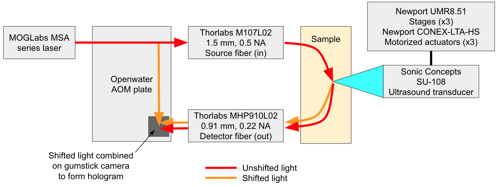

## Holographic Acousto-optic System Hardware Overview
This repository contains information regarding the hardware used for the setup of an Openwater holographic acousto-optic imaging system. The imaging system uses the following components:
- Optical:
  - MOGLabs MSA series laser (765/795/850 nm)
  - IntraAction ATM-901A2 AOM (x2)
  - IntraAction PA-704 power amplifier (x2)
  - Thorlabs M107L02 optical fiber (1.5 mm diameter, 0.5 NA)
  - Thorlabs MHP910L02 optical fiber (0.91 mm diameter, 0.22 NA)
- Mechanical & Ultrasound:
  - Sonic Concepts SU-108 ultrasound transducer
  - E&I 411LA power amplifier
  - Newport UMR8.51 stage (x3)
  - Newport CONEX-LTA-HS motorized actuator (x3)
  - Newport CONEX-CC stage controller (x3)
- Electrical:
  - Rigol DG4162 arbitrary waveform generator (x2)
  - Berkeley Nucleonics Model 525 delay/pulse generator
  - Thorlabs PDA100A2 photodiode (x2)
  - NI USB-6002 multifunction I/O DAQ
  - Dell desktop computer
  - BNC, USB-A, USB-B, USB-C, USB-microB, mini-USB cables
- Custom Parts:
  - Openwater AOM plate (see below)
  - Openwater Gumstick camera (see below)

## Optical Layout
Optical connections and components for the system can be found below:

## Electrical Layout
Electrical connections for the system can be found below:

## Included Files in this Repository
- [AOM plate](opw_acousto-optic_AomPlate.EASM)
- [AOM layout](opw_acousto-optic_AomPlateLayout.png)
- [AOM BOM](opw_acousto-optic_AomPlateBOM.xlsx)
- [Gumstick Altium Files link (Gen1 HW repo)](gumstick_AltiumFiles.zip)
- [Various in vivo small animal holders and setups](Animal_Holders)

## Additional acousto-optic repositories here:
- [Link to the software repository](https://github.com/OpenwaterInternet/opw_acousto-optic_sw/)
- [Link to the example data repository](https://github.com/OpenwaterInternet/opw_acousto-optic_data/)
