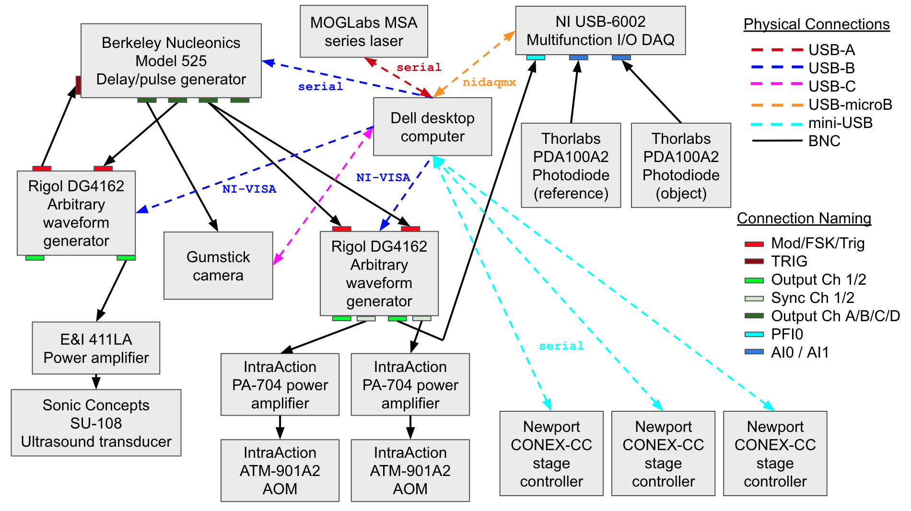

## Holographic Acousto-optic System Hardware Overview
Text here

## Optical Layout
Optical connections and components for the system can be found below:

## Electrical Layout
Electrical connections for the system can be found below:

## Included Files in this Repository
- [AOM plate](opw_acousto-optic_AomPlate.EASM)
- [AOM layout](opw_acousto-optic_AomPlateLayout.png)
- [AOM BOM](opw_acousto-optic_AomPlateBOM.xlsx)
- [Gumstick Altium Files link (Gen1 HW repo)](gumstick_AltiumFiles.zip)
- [Various in vivo small animal holders and setups](Animal_Holders)

## Additional acousto-optic repositories here:
- [Link to the software repository](https://github.com/OpenwaterInternet/opw_acousto-optic_sw/)
- [Link to the example data repository](https://github.com/OpenwaterInternet/opw_acousto-optic_data/)
